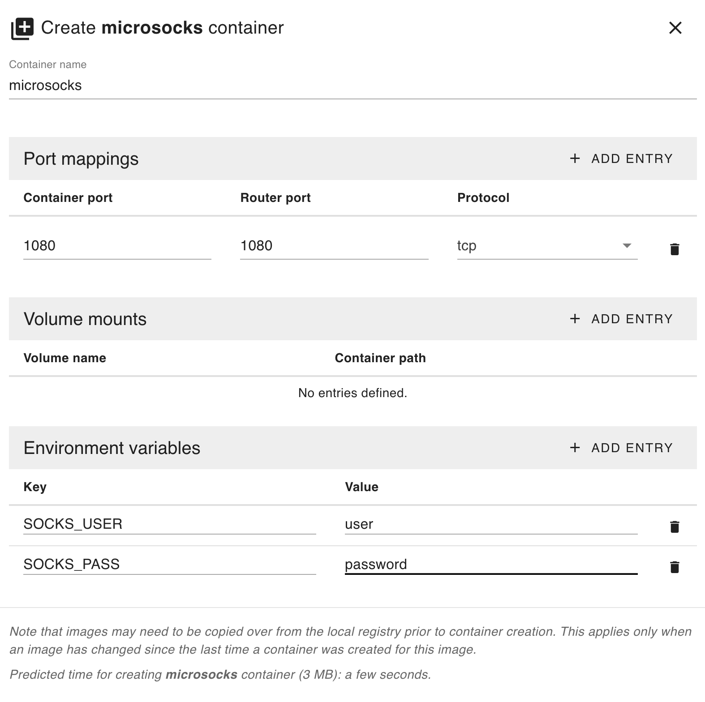

# Edge App - MicroSocks

The Edge App - MicroSocks provides a simple and efficient way to run a SOCKS5 proxy on IXON SecureEdge Pro, enabling secure and flexible network routing for various use cases. By leveraging the heywoodlh/microsocks Docker container, the Edge App allows you to quickly deploy a proxy with authentication, ensuring adaptable and secure connectivity tailored to your needs.

Key Features:

1. Quick Deployment: Easily set up and run a SOCKS5 proxy in seconds.
2. Authentication Options: Support for username/password to restrict access when needed.
3. Efficient Design: Lightweight and optimized for secure routing on SecureEdge Pro hardware

## Prerequisites

Ensure your environment is properly set up by following this guide: [Running custom Docker applications on the SecureEdge Pro](https://support.ixon.cloud/hc/en-us/articles/14231117531420-Running-custom-Docker-applications-on-the-SecureEdge-Pro).

## Steps to Deploy

### 1. Build and Push the Container

Ensure you have the correct builder in use:

For Unix-based systems:

```bash
./setup-buildx-env.sh
```

For Windows:

```cmd
setup-buildx-env.cmd
```

Run the script to build and push the container to the SecureEdge Pro:

For Unix-based systems:

```bash
./build_and_push_containers.sh
```

For Windows:

```cmd
build_and_push_containers.cmd
```

### 2. Set Up MicroSocks on SecureEdge Pro

- Access the local web interface of the SecureEdge Pro.
- Create a `microsocks` container using the `microsocks` image with the following port mappings:

  ```
  Port Mapping: 1080:1080
  ```

- Overwrite the default environment variables:

  ```
  SOCKS_USER
  SOCKS_PASS
  ```

Refer to the screenshot for configuration details:  


### 3. Start the Containers

- Wait for the containers to be created.
- Start the containers.

### 4. You now have a running MicroSocks container on your SecureEdge Pro!

### 5. Configure Your Client

- Configure your client to use the SOCKS5 proxy with the IP address of the SecureEdge Pro and port 1080.
- Use the provided username and password.

## Additional Information

Google Chrome does not natively support SOCKS5 proxies with username and password authentication. This limitation means that even if your SOCKS5 proxy requires authentication, Chrome cannot provide the necessary credentials during connection. As a result, attempts to use such proxies directly in Chrome will fail.

https://github.com/FelisCatus/SwitchyOmega/issues/1455?utm_source=chatgpt.com

option -1 activates auth_once mode: once a specific ip address authed successfully with user/pass, it is added to a whitelist and may use the proxy without auth. this is handy for programs like chrome that don't support user/pass auth. for it to work you'd basically make one connection with another program that supports it, and then you can use firefox too. for example, authenticate once using curl:

```bash
curl --socks5 yourUsername:yourPassword@192.168.140.1:1080 example.com
```
